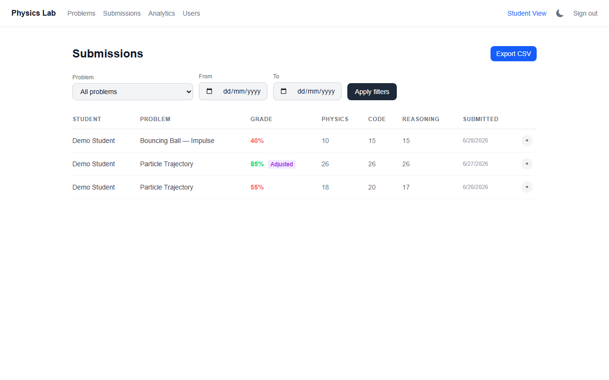
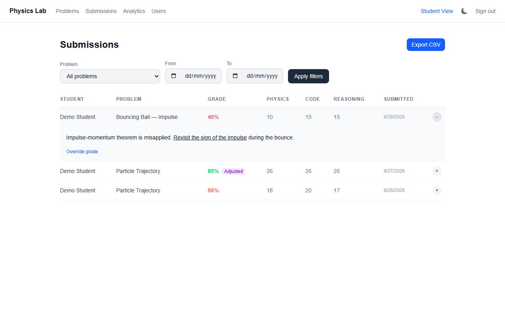
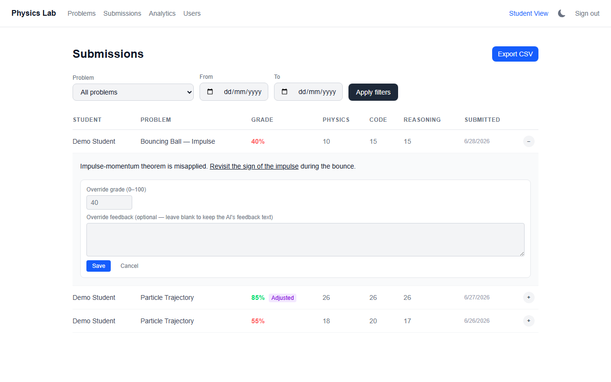
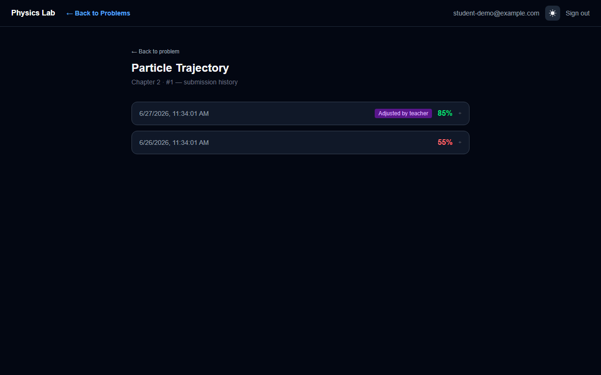
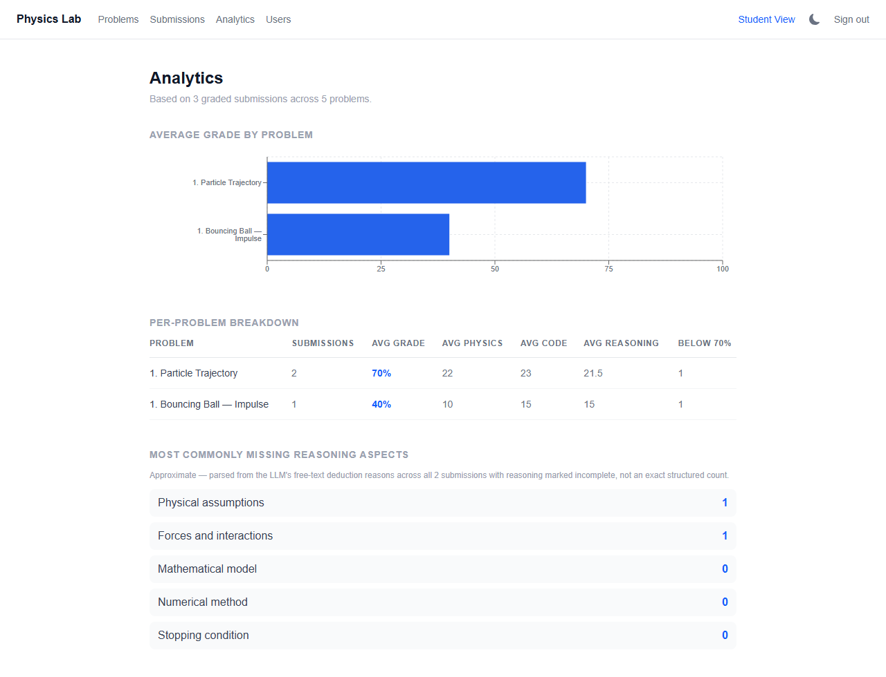

# Physics VPL — Virtual Programming Lab

A web application for physics courses where students write Python code to solve simulation problems. Submissions are automatically graded by a local LLM that evaluates physics correctness, coding quality, and the quality of the student's physical reasoning in their comments.

> **New here?** [`docs/GUIDE.md`](docs/GUIDE.md) is a full walkthrough with screenshots, a zero-to-running install guide, and a line-by-line explanation of how the code works. This README is the quick reference.
>
> **Want to skip installing Node/Python/MongoDB/Ollama by hand?** [`docs/DOCKER.md`](docs/DOCKER.md) runs the whole stack — app, database, and the LLM itself — in containers with one `docker compose up`.

---

## Features

- **In-browser Python editor** (Monaco) with live code execution and graph output
- **Resizable layout** — drag to resize the problem panel width and the output panel height to fit your workflow
- **LLM-powered grading** via a local Ollama model — evaluates three independent categories
- **Structured, LaTeX-rendered feedback** — bold, underlined section labels (Physics / Coding / Reasoning / Priority) with inline math rendered through KaTeX
- **LaTeX problem statements** rendered with KaTeX, supporting full mathematical notation
- **Role-based access** — Admin, Teacher, and Student dashboards
- **Submission history** with per-category score breakdown and actionable feedback
- **Teacher submissions table** with an expandable row per submission to view the full LLM feedback inline, without leaving the table
- **Dark / light theme** — toggle with the sun/moon icon in the header, available on every page
- **"Back to Problems" navigation** — a link in the header while solving a problem, so you're never stuck using the browser's back button

---

## Grading System

Each submission is scored across three categories, weighted as follows:

| Category | Weight | What is evaluated |
|---|---|---|
| Physics | 40% | Correct physical model, formulas, and constants |
| Coding | 40% | Correct numerical results and valid implementation |
| Reasoning | 20% | Quality of comments explaining the physical reasoning |

The reasoning score is based on how many of these 5 aspects the student's comments cover:

1. Physical assumptions
2. Forces and interactions
3. Mathematical model
4. Numerical method
5. Stopping / detection condition

**Scoring:** 5 aspects = 100, 4 = 80, 3 = 60, 2 = 40, 1 = 20, 0 = 0

The final grade is calculated programmatically from the three component scores — the LLM cannot inflate it.

---

## Tech Stack

| Layer | Technology |
|---|---|
| Framework | Next.js 16.2.7 (App Router, Turbopack) |
| Language | TypeScript |
| Styling | Tailwind CSS v4 |
| Database | MongoDB Atlas via Mongoose |
| Auth | NextAuth v5 (JWT, one-time login-code credentials — no email/password) |
| LLM | Ollama (local, any compatible model) |
| Code editor | Monaco Editor |
| Graphs | Recharts |
| Math rendering | React Markdown + `remark-math` + `rehype-katex` + `rehype-raw` (for `<u>` underline support in feedback) |
| Code execution | Python (server-side via `child_process.spawn`) |
| Validation | Zod |

---

## Prerequisites

- **Node.js** v18+
- **Python** (accessible as `python` or `python3` in your PATH)
- **Ollama** running locally — download from [ollama.com](https://ollama.com)
- **MongoDB Atlas** account (free tier works)

### Recommended Ollama models

| Machine | Recommended model |
|---|---|
| Strong PC (16GB+ VRAM) | `qwen2.5:14b` |
| Mid-range PC (8GB+ VRAM) | `qwen2.5:7b` |
| Laptop / lower RAM | `qwen2.5:3b` |

Pull your chosen model before starting:
```bash
ollama pull qwen2.5:14b
```

---

## Setup

### 1. Clone and install

```bash
git clone https://github.com/orshterenshus/physics_vpl.git
cd physics_vpl
npm install
```

### 2. Install Python dependencies

```bash
python -m pip install numpy
```

### 3. Create `.env.local`

Copy the template and fill in your own values:

```bash
cp .env.local.example .env.local
```

```env
MONGODB_URI=mongodb+srv://<user>:<password>@<cluster>.mongodb.net/<dbname>
AUTH_SECRET=<any-random-secret-string>
NEXTAUTH_URL=http://localhost:3000
OLLAMA_BASE_URL=http://127.0.0.1:11434
OLLAMA_MODEL=qwen2.5:14b
PYTHON_CMD=python
```

> **Note:** Use `127.0.0.1` not `localhost` for `OLLAMA_BASE_URL` — Ollama binds to IPv4 only.

### 4. Start the development server

```bash
npm run dev
```

Open [http://localhost:3000](http://localhost:3000).

### 5. Bootstrap the first admin account (first run only)

There's no login UI for creating the very first user — the database starts empty. A one-time API endpoint creates the first admin: it works exactly once and refuses to run again once any user exists.

```bash
curl -X POST http://localhost:3000/api/setup \
  -H "Content-Type: application/json" \
  -d "{\"name\": \"Your Name\", \"email\": \"you@example.com\", \"password\": \"choose-a-real-password\"}"
```

Go to `/login`, click "Admin? Sign in with email & password," and sign in with that email and password — unlike student/teacher codes, this isn't one-time, so it keeps working across logins. See [Authentication](#authentication) below for why admin works differently from student/teacher logins.

### 6. Seed example problems (optional)

```bash
node scripts/seed.mjs
```

This populates the database with the example physics problems used throughout this README (Particle Trajectory, Bouncing Ball, etc.) — it does **not** create any user accounts.

---

## Project Structure

```
physics_vpl/
├── app/
│   ├── (admin)/          # Admin dashboard — manage users
│   ├── (teacher)/        # Teacher dashboard — create/edit problems, view submissions
│   ├── (student)/        # Student dashboard — browse problems, submit solutions
│   ├── api/
│   │   ├── run-code/     # Executes student Python code server-side (10s timeout)
│   │   ├── submissions/  # Submit code and poll for grade results
│   │   ├── problems/     # CRUD for problems
│   │   └── admin/        # Admin-only user and problem management
│   └── login/            # Login-code entry page (no email/password)
├── components/
│   ├── editor/
│   │   ├── ProblemSolver.tsx   # Main student view: resizable editor + run + submit
│   │   ├── ProblemEditor.tsx   # Teacher problem creation/editing form
│   │   └── GraphPanel.tsx      # Recharts graph output panel
│   ├── teacher/
│   │   └── SubmissionsTable.tsx   # Submissions table with expandable per-row feedback view
│   └── ui/               # Theme toggle, sign-out button
├── lib/
│   ├── evaluate.ts       # LLM evaluation engine (Ollama integration + grading logic)
│   ├── auth.ts           # NextAuth full config (with DB)
│   ├── auth.config.ts    # Lean NextAuth config (no DB, used in middleware)
│   ├── session.ts        # Session-only auth import (avoids mongoose on page load)
│   └── db.ts             # MongoDB connection
├── models/
│   ├── User.ts           # Roles: student | teacher | admin
│   ├── Problem.ts        # Chapter, problem number, description, starter code, teacher solution
│   └── Submission.ts     # Grade, feedback, physicsScore, codingScore, reasoningScore, deductionReasons
├── scripts/
│   └── seed.mjs          # Database seed script
└── Q1 examples for grading.md   # Sample solutions showing expected scores for Q1
```

---

## Authentication

There's no email-sending service anywhere in this app. Login works differently depending on role:

**Students and teachers** sign in with a single one-time **code**:

1. An admin (or teacher) creates the account via the [`/admin`](#admin) Users page. Creating it generates a random 8-character code (e.g. `A4K9PX3M`) and stores it on that user's record.
2. The admin/teacher gives that code to the person (verbally, by chat, however).
3. That person goes to `/login`, types the code in, and is signed in.
4. The code is single-use: the instant it's used to log in successfully, it's cleared from the database. To let that person log in again later (e.g. a new browser/device), an admin generates them a fresh code from the Users page.

**Admins** sign in with an email + a real password instead (the "Admin? Sign in with email & password" link on `/login`) — not a one-time code. This is deliberate: an admin who gets logged out with nobody else around to issue them a fresh code would otherwise be permanently locked out. A password persists across logins like a normal account. The very first admin is created via `POST /api/setup` (see Setup above) with `{ name, email, password }`; every other admin is created the same way an admin creates anyone else, from the Users page, just with a password field instead of a generated code.

Whenever an admin's password is (re)set — at creation, via "Set new password" on the Users page, or via the Docker recovery script — the account is flagged `mustChangePassword`. The next time that account logs in, every page redirects to `/change-password` until a new password (8+ characters) is set; logging in with the old password no longer works the moment the new one is saved. This is what makes it safe for the Docker setup to default to the literal username/password `admin`/`admin` — the first real login forces it to be replaced. If every admin is locked out with no way to log in at all, `node scripts/reset-admin-password.mjs <email> <new-password>` sets a fresh password directly in the database (it reads `MONGODB_URI` from `.env.local`).

Both flows are handled by the same NextAuth v5 `Credentials` provider (`lib/auth.ts`) — it checks for a `password` field first (looked up by email, verified with `bcrypt.compare` against a hashed `passwordHash`), and falls back to the one-time-code lookup (`User.findOne({ loginCode: code })`) otherwise.

---

## User Roles

### Student
- Browse problems organised by chapter — each one shows its latest grade once solved, or "Solve" if not yet attempted
- Write and run Python code in the browser
- Submit for grading — results appear within seconds
- View score breakdown (physics / coding / reasoning) and feedback
- Jump back to the problem list anytime with the "Back to Problems" link in the header (only shown while inside a problem)
- Open "History (n)" next to any attempted problem to see every past submission for it, oldest details collapsed and expandable

### Teacher
- Create and edit problems with LaTeX descriptions, starter code, and a reference solution
- Add evaluation hints that guide the LLM grader
- View all graded student submissions, with score breakdown per category — submissions still pending grading are excluded from this view
- Click the **+** at the end of a submission row to expand it and read the full structured LLM feedback inline
- Filter the Submissions page by problem and/or date range, and export the filtered results as CSV
- Override the AI's grade and/or feedback on any submission, and revert back to the AI's original call at any time
- View class-wide analytics: average grade per problem and the most commonly missing reasoning aspects

### Admin
- All teacher permissions
- Create and manage user accounts (student, teacher, or admin)
- Generate one-time login codes for students/teachers, or set passwords for admin accounts — share either directly; there is no email step

---

## How Code Execution Works

When a student clicks **Run**:

1. The browser sends the code to `/api/run-code`
2. The server spawns a Python process (10-second timeout)
3. The student's code is wrapped in a try/except and `print` is captured
4. A `physics` helper object and a `set_graph(x, y, label)` function are injected automatically
5. Output and graph data are returned to the browser

```python
# These are available in every submission without importing:
physics.euler_step(position, velocity, acceleration, dt)
physics.kinetic_energy(mass, velocity)
physics.potential_energy(mass, g, height)
# ...

set_graph(x_list, y_list, label="My Graph")  # renders a chart in the UI
```

> **Tip:** Avoid `dt` values smaller than `1e-4` for simulations over 10 seconds — this creates millions of iterations and will timeout.

---

## How Grading Works

When a student clicks **Submit**:

1. The submission is saved to MongoDB with `grade: null`
2. Grading runs asynchronously in the background
3. The frontend polls until a grade appears
4. The LLM is called via Ollama with a structured prompt (see `lib/evaluate.ts`)
5. The JSON response is validated with Zod
6. The grade is recalculated programmatically from the three component scores

**Programmatic reasoning overrides** (applied after the LLM responds):
- No comments at all → reasoning score forced to 0
- Only block comments (`"""..."""`) → reasoning score capped at 25
- Inline `#` comments → LLM score is trusted

### Feedback format

The feedback text returned by the LLM is structured into four labelled parts, each on its own bold, underlined heading, with math written in plain-character LaTeX (`$...$`) so it renders cleanly through KaTeX:

```
**<u>Physics:</u>** ...
**<u>Coding:</u>** ...
**<u>Reasoning:</u>** ...
**<u>Priority:</u>** ...
```

To keep this reliable with a small local model emitting constrained JSON, the prompt forbids a few patterns that are known to break either JSON parsing or KaTeX rendering:
- No backslash LaTeX commands (`\sin`, `\omega`, `\text{...}`) — a stray unescaped backslash corrupts the JSON string. Greek letters are written as literal Unicode glyphs (ω, θ, Δ) instead.
- No `text{...}` wrapper without a backslash (renders as garbled adjacent letters in KaTeX).
- No accent/combining characters for unit-vector "hat" notation (e.g. x̂) — KaTeX throws a parse error on malformed accents, which previously left submissions stuck on "Pending" in the UI even though grading had completed successfully server-side.

---

## Teacher Tools

Four features round out the teacher/admin side of the app: filtering and exporting submissions, manually overriding a grade, browsing a student's submission history, and a class-wide analytics dashboard.

### Filter and export submissions

The Submissions page (`/teacher/submissions`) has a filter bar for problem and date range. "Export CSV" downloads exactly the filtered set — same query, same rows, as a CSV file with a human-readable `Submitted (UTC)` column.



### Manual grade override

Click **+** to expand any row, then **Override grade** to set a corrected grade and/or feedback. The AI's original grade and feedback are never deleted — only layered over — so the original call is always recoverable via **Clear override**. Anywhere a grade or feedback is shown to the student (problem list, problem page, submission history) it reflects the override when one exists, with a purple **Adjusted** badge marking it as teacher-corrected.





### Submission history (student-facing)

Students see a "History (n)" link next to any problem they've attempted more than once, showing every past submission for that problem with its grade and an expandable feedback panel — handy for resubmissions and revisiting a teacher's override.



### Analytics dashboard

`/teacher/analytics` shows a horizontal bar chart of the average grade per problem, a per-problem breakdown table (submission count, average grade, average physics/coding/reasoning, and how many submissions are below 70%), and a best-effort count of which reasoning aspects are most often missing — parsed from the LLM's free-text deduction reasons, so it's labelled "Approximate" rather than an exact structured count.



---

## Grading Examples (Q1 — Particle Trajectory)

The table below shows the four reference examples from [`Q1 examples for grading.md`](Q1%20examples%20for%20grading.md), which demonstrate the full range of expected scores.

| Example | Physics | Coding | Reasoning | **Final Grade** | Key issues |
|---|---|---|---|---|---|
| 1 — Perfect | 100 | 100 | 100 | **100** | None — correct formula, correct Euler, all 5 comment aspects |
| 2 — Good | ~75 | 100 | 60 | **~82** | Sign error in `ay` formula; only 3/5 comment aspects |
| 3 — Failing | ~45 | ~40 | 20 | **~38** | Constant acceleration (evaluated only at t=0); wrong distance formula; wrong stopping condition |
| 4 — Very poor | ~45 | ~50 | 0 | **~38** | Wrong physical model (`-ω²x` instead of given formula); wrong Euler order; float equality check that never triggers; no comments |

### Reasoning aspect checklist (for Q1)

| Aspect | What to look for in the comments |
|---|---|
| 1. Physical assumptions | Mentions units of A (m/s) and ω (rad/s), or notes values are arbitrary |
| 2. Forces and interactions | References Newton's second law, F=ma, or explains what the acceleration represents |
| 3. Mathematical model | Writes out or references the ax / ay equations |
| 4. Numerical method | Names "Forward Euler" and/or explains the v and x update rules |
| 5. Stopping condition | Explains that vy=0 means tangent parallel to x-axis; describes the sign-change detection |

> Full annotated code for all four examples is in [`Q1 examples for grading.md`](Q1%20examples%20for%20grading.md).

---

## Physics Deduction Reference

| Error | Points deducted from Physics |
|---|---|
| Completely wrong physical model | 30 – 40 |
| Key formula incorrect | 20 – 30 |
| Required physical effect missing | 10 – 20 |
| Wrong physical constant | 8 – 15 |
| Unit handling error | 5 – 12 |
| Minor approximation with small effect | 2 – 8 |

## Coding Deduction Reference

| Error | Points deducted from Coding |
|---|---|
| Code produces numerically wrong results | 25 – 35 |
| Wrong numerical method causing significant error | 15 – 25 |
| Step size or loop bounds cause significant numerical error | 8 – 18 |
| Off-by-one or incorrect loop ranges | 5 – 12 |

> Style, variable naming, data structure choice, and step size choice **never** cause coding deductions.

---

## Environment Variables Reference

| Variable | Description |
|---|---|
| `MONGODB_URI` | MongoDB Atlas connection string |
| `AUTH_SECRET` | Random secret for NextAuth JWT signing |
| `NEXTAUTH_URL` | Full URL of the app (e.g. `http://localhost:3000`) |
| `OLLAMA_BASE_URL` | Ollama API base URL — use `http://127.0.0.1:11434` |
| `OLLAMA_MODEL` | Model name (e.g. `qwen2.5:14b`) |
| `PYTHON_CMD` | Python binary name — `python` on Windows, `python3` on Linux/Mac |
