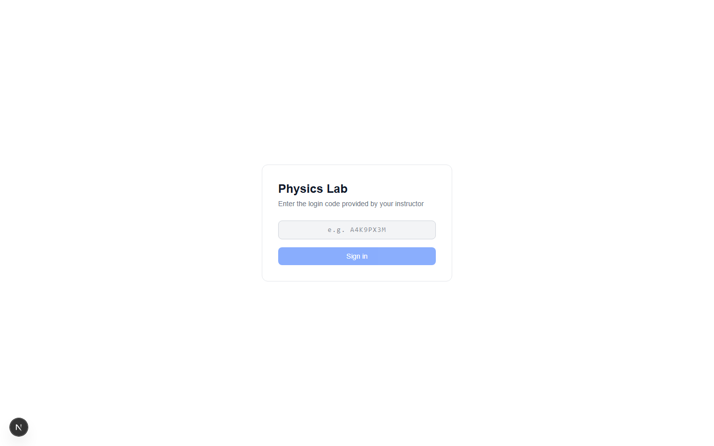
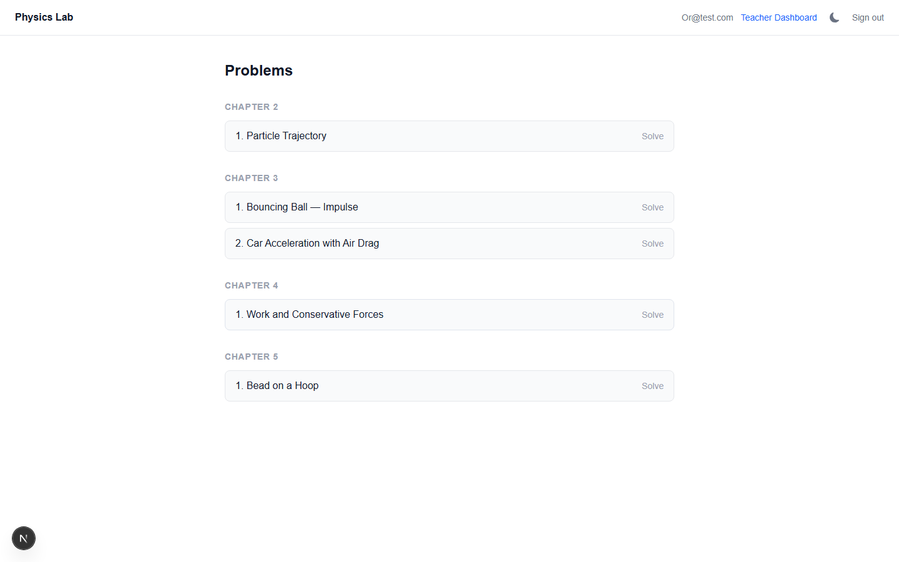
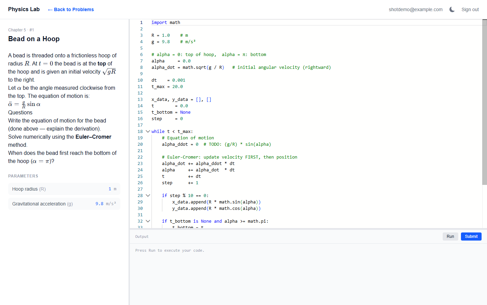
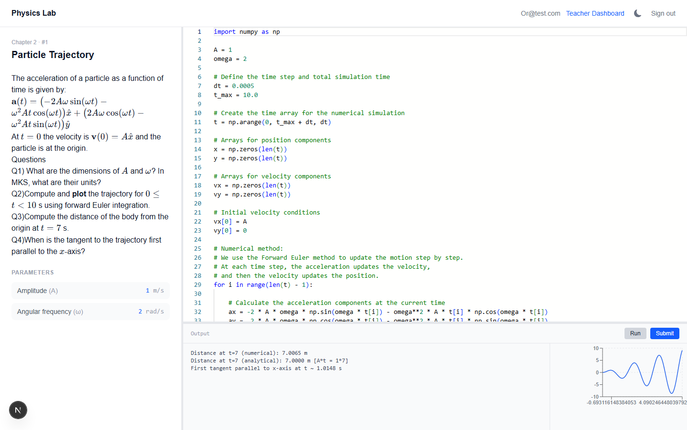
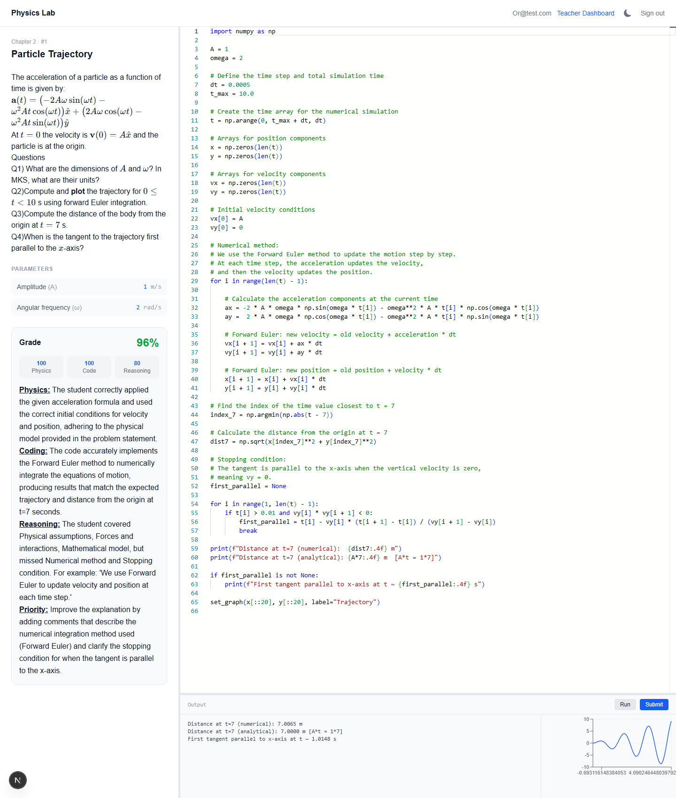
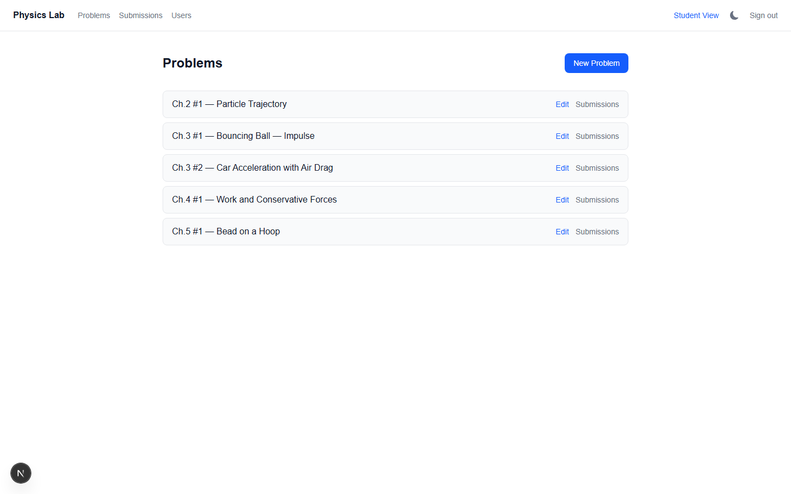
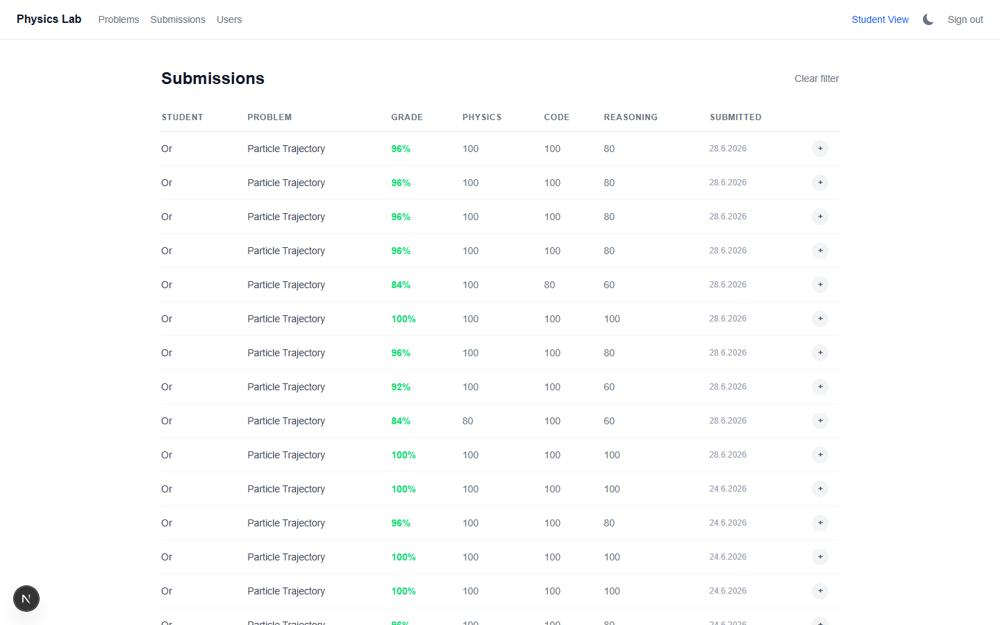
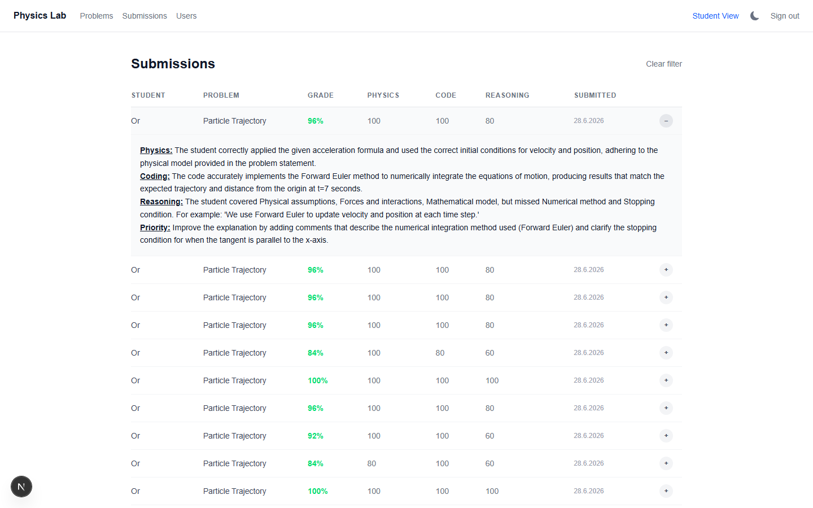
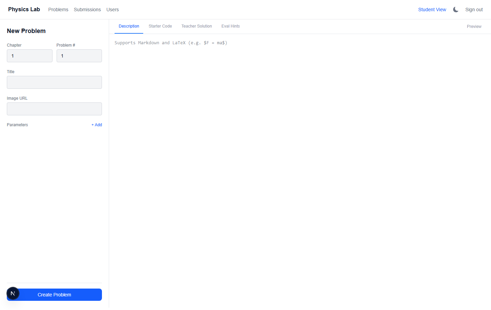
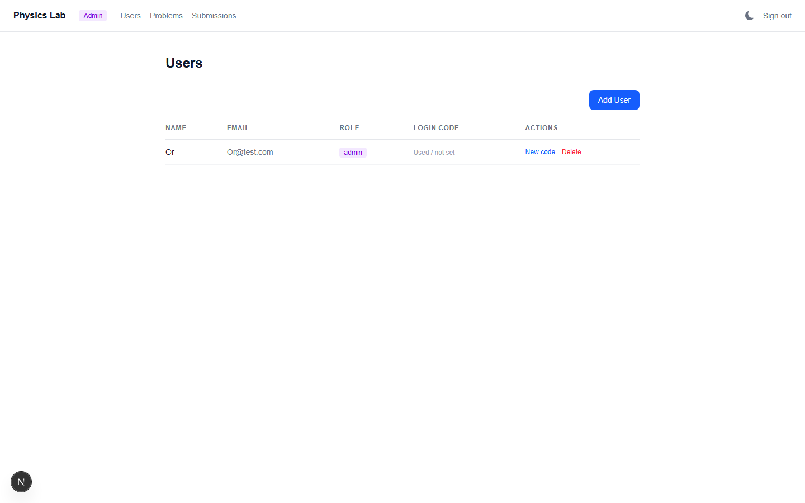

# Physics VPL — Complete Guide

This is the deep-dive companion to [`README.md`](../README.md). The README is a quick reference; this document is meant to be read top to bottom by someone who has never seen the project before, and walks away understanding it as well as the person who built it — what it does, how to run it from a completely empty machine, and how every part of the code actually works.

## Table of contents

1. [What this project is](#what-this-project-is)
2. [Visual walkthrough](#visual-walkthrough)
3. [Technology stack, with exact versions](#technology-stack-with-exact-versions)
4. [System architecture at a glance](#system-architecture-at-a-glance)
5. [Full installation guide, from zero](#full-installation-guide-from-zero)
6. [Authentication, in detail](#authentication-in-detail)
7. [Code deep-dive](#code-deep-dive)
8. [Known unused / legacy code](#known-unused--legacy-code)
9. [Troubleshooting](#troubleshooting)
10. [Appendix: environment variables and npm scripts](#appendix-environment-variables-and-npm-scripts)

---

## What this project is

Physics VPL ("Virtual Programming Lab") is a web app built to replace a traditional physics exam. Instead of solving problems on paper, a student:

1. Reads a physics problem (rendered with full LaTeX math) in the browser.
2. Writes a **Python** program that simulates/solves it (using NumPy).
3. Runs the code in-browser to see printed output and a plotted graph.
4. Submits it, and within roughly 10–30 seconds gets back a **grade out of 100** plus **written feedback**, generated entirely by a **local LLM** (no cloud AI API, no internet dependency for grading) running through [Ollama](https://ollama.com).

The grading is not a single fuzzy "AI score" — it's three independent, separately-scored categories (physics correctness, code correctness, and quality of the student's own explanatory comments), combined with a fixed formula that the LLM does not control. That design decision (explained fully in [the grading engine section](#the-grading-engine-libevaluatets)) is the most carefully-tuned part of the codebase.

There's also a teacher side: a dashboard to author problems (with a reference "teacher solution" the grader compares against), and a table of every student submission with its score breakdown and full feedback text.

---

## Visual walkthrough

All screenshots below were taken directly from a running instance of this app on `localhost:3000`.

### 1. Logging in

There's no email and no password. The login screen asks for a one-time **code** that an admin/teacher generated for you (see [Authentication](#authentication-in-detail)).



### 2. The student's problem list

After logging in, a student lands on `/problems` — every problem in the database, grouped by chapter. Each row shows either **"Solve"** (never attempted) or that student's **latest grade** on that problem (e.g. `92%`, colored green/red the same as the grade card on the solve page) — so a student can see at a glance what they've already completed without opening each one. This reflects the most recent graded submission only, not the best one; resubmitting a problem updates what's shown here even if an earlier attempt scored higher.



### 3. Solving a problem

Clicking a problem opens the main workspace: the problem statement (with rendered LaTeX, e.g. the boxed acceleration formula below) on the left, a Monaco code editor on the right, and the problem's named parameters (here, `A` and `ω`) shown as a quick-reference panel. Both the left/right split and the editor/output split are **draggable** — note the thin resize handles between panels.



### Back to Problems button

Notice the bold **"← Back to Problems"** link next to the logo in the header in the screenshot above. It only appears while you're actually inside a problem — it's gone again on the bare `/problems` list itself, since it would be pointless there. Click it any time to return to the full problem list without using your browser's back button.

### 4. Running code

Clicking **Run** sends the code to the server, which executes it in a real Python process and returns whatever it printed, plus a graph if the code called `set_graph(...)`. Here the student's forward-Euler simulation correctly reproduces the spiral trajectory and prints both the numerical and analytical distance at `t = 7s`.



### 5. Submitting for a grade

Clicking **Submit** saves the code and kicks off grading in the background. The UI polls every 2 seconds until a grade appears. Once graded, a card shows the overall grade plus the three component scores (Physics / Code / Reasoning), followed by structured feedback — written in Markdown with bold, underlined section headers and inline LaTeX math, explaining exactly why each score is what it is.



### 6. Teacher dashboard

Teachers (and admins) see every problem with **Edit** and **Submissions** links.



### 7. Reviewing submissions

Clicking "Submissions" for a problem opens a filtered table of every student's attempt at that problem, with the same three-category breakdown.



### 8. Reading full feedback inline

Clicking the **+** at the end of any row expands it in place to show that submission's complete feedback text — no need to leave the table.



### 9. Authoring a problem

"New Problem" opens a tabbed editor: form fields for chapter/number/title/parameters on the left, and tabs for the Markdown+LaTeX description, the starter code shown to students, the teacher's reference solution, and free-text evaluation hints for the grader.



### 10. Managing users

Admins create accounts and generate/regenerate login codes from `/admin`.



### Dark / light mode

Every screen in every screenshot above has a sun/moon icon in the header (`ThemeToggle.tsx`) — click it to switch between light and dark mode. The choice is remembered (via `next-themes`, see `ThemeProvider.tsx`) so it persists across page loads and logins; it defaults to whatever your operating system/browser is set to until you toggle it yourself.

---

## Technology stack, with exact versions

These are the **exact** pinned/installed versions from this project's `package.json` and `node_modules` at the time of writing — not just "whatever's latest."

| Layer | Technology | Version |
|---|---|---|
| Framework | Next.js (App Router) | `16.2.7` |
| UI library | React / React DOM | `19.2.4` |
| Language | TypeScript | `^5` |
| Styling | Tailwind CSS | `^4` (via `@tailwindcss/postcss`) |
| Database | MongoDB (Atlas or self-hosted) via Mongoose | `mongoose ^9.6.3`, `mongodb ^6.21.0` |
| Auth | NextAuth | `^5.0.0-beta.31` |
| LLM runtime | Ollama | external, any recent version |
| Code editor | Monaco Editor (`@monaco-editor/react`) | `^4.7.0` |
| Charting | Recharts | `^3.8.1` |
| Markdown/Math rendering | `react-markdown` `^10.1.0` + `remark-math` `^6.0.0` + `rehype-katex` `^7.0.1` + `rehype-raw` `^7.0.0` + `katex` `^0.17.0` | |
| Schema validation | Zod | `^4.4.3` |
| Code execution | Python via Node's `child_process.spawn` | — |

**Runtime requirements (not npm packages):**

| Tool | Minimum version | Why |
|---|---|---|
| Node.js | **≥ 20.9.0** | This is Next.js 16's own hard-enforced minimum (`package.json` → `engines.node` inside the installed `next` package). Older Node will fail to even start the dev server. |
| Python | 3.9+ recommended | Needs to support f-strings and modern NumPy. Must be reachable on PATH as `python` or `python3`. |
| NumPy | any recent version | The only Python package this project depends on (`pip install numpy`). |
| Ollama | any version that supports `/api/generate` with `format: "json"` | This has been stable in Ollama for a long time; no exotic feature is required. |
| MongoDB | 4.4+ (Atlas free tier is plenty) | Standard Mongoose compatibility floor. |

A few packages are installed but **not actually used** anywhere in the current code — see [Known unused / legacy code](#known-unused--legacy-code) for the full list and why they're harmless to ignore (or safe to remove later).

---

## System architecture at a glance

```
                     ┌─────────────────────────┐
                     │        Browser           │
                     │  (Next.js client compo-  │
                     │   nents: Monaco editor,   │
                     │   React state, polling)   │
                     └────────────┬─────────────┘
                                  │ HTTP (same origin)
                                  ▼
                     ┌─────────────────────────┐
                     │   Next.js server (App     │
                     │   Router, route handlers   │
                     │   under app/api/*)         │
                     └──┬──────────┬───────────┘
                         │          │
          spawn() Python │          │ fetch()
          subprocess     │          ▼
                         │   ┌─────────────────┐
                         │   │  Ollama (local)   │
                         │   │  /api/generate     │
                         │   │  qwen2.5:14b etc.  │
                         │   └─────────────────┘
                         ▼
                ┌─────────────────┐
                │  python -c "..." │
                │  (10s timeout)   │
                └─────────────────┘

                     ┌─────────────────────────┐
                     │   MongoDB (Atlas or       │
                     │   self-hosted)             │
                     │   users / problems /       │
                     │   submissions collections  │
                     └─────────────────────────┘
```

Two requests matter most:

- **Run** (`POST /api/run-code`): browser → Next.js → spawns a real `python` process with the student's code wrapped in a small harness → captures stdout → returns JSON to the browser. Nothing is written to the database. This is purely "try it out."
- **Submit** (`POST /api/submissions`): browser → Next.js writes a `Submission` document with `grade: null` → immediately returns a submission ID to the browser → **in the background** (not awaited, fire-and-forget), the server calls Ollama with a long structured prompt, validates the JSON it gets back, and writes the final grade/feedback into that same document. The browser polls `GET /api/submissions/[id]` every 2 seconds until `grade` is non-null, for up to 5 minutes — generous on purpose, since LLM inference can occasionally take well over a minute (especially without a GPU). After ~60 seconds with no result yet, the UI shows a "still working" hint rather than going quiet.

---

## Full installation guide, from zero

This section assumes a brand-new machine with nothing installed. Every step is something that actually had to be done to get this project running.

### Step 1 — Install Node.js

Download Node.js **20 LTS or newer** from [nodejs.org](https://nodejs.org) (Next.js 16 will refuse to run on anything older than 20.9.0). After installing, verify:

```bash
node --version   # should print v20.9.0 or higher
npm --version
```

### Step 2 — Install Python and NumPy

Install Python 3.9+ from [python.org](https://python.org) (on Windows, make sure "Add python.exe to PATH" is checked during install). Then:

```bash
python -m pip install numpy
```

Verify it's reachable:

```bash
python --version
python -c "import numpy; print(numpy.__version__)"
```

> On Linux/macOS the binary is usually `python3`, not `python`. The app auto-detects this (`PYTHON_CMD` defaults to `python3` on non-Windows platforms — see `app/api/run-code/route.ts`), but you can override it explicitly in `.env.local` if your system differs.

### Step 3 — Install and run Ollama

Ollama is what runs the grading LLM **entirely on your own machine** — no API key, no cloud cost, no internet required once the model is downloaded.

1. Download and install from [ollama.com](https://ollama.com) (Windows, macOS, and Linux all supported).
2. Pull a model. Model choice depends on your hardware:

   | Your machine | Recommended model | Approx. download size |
   |---|---|---|
   | Strong PC / workstation (16GB+ VRAM) | `qwen2.5:14b` | ~9 GB |
   | Mid-range PC (8GB+ VRAM) | `qwen2.5:7b` | ~4.7 GB |
   | Laptop / limited RAM or no dedicated GPU | `qwen2.5:3b` | ~2 GB |

   ```bash
   ollama pull qwen2.5:14b
   ```

3. Ollama runs as a background service automatically after install and listens on port `11434`. Verify it's alive:

   ```bash
   curl http://127.0.0.1:11434/api/tags
   ```

   You should get back JSON listing the model(s) you pulled. If this fails, Ollama isn't running — start it manually (on most platforms it's just launching the Ollama app/service once, and it stays running).

> **Important gotcha:** always use `127.0.0.1`, never `localhost`, when pointing this app at Ollama. Ollama's default bind only listens on the IPv4 loopback address, and on some systems `localhost` resolves to the IPv6 loopback (`::1`) first, which will silently fail to connect.

### Step 4 — Set up MongoDB

The easiest path is a free MongoDB Atlas cluster (no local database server to maintain):

1. Create a free account at [mongodb.com/cloud/atlas](https://www.mongodb.com/cloud/atlas).
2. Create a free (M0) cluster.
3. Under **Database Access**, create a database user with a username/password.
4. Under **Network Access**, add your current IP address (or `0.0.0.0/0` for "allow from anywhere," fine for local development, not recommended for a production deployment).
5. Click "Connect" on your cluster, choose "Drivers," and copy the connection string — it looks like:
   ```
   mongodb+srv://<username>:<password>@<cluster-name>.mongodb.net/<database-name>
   ```

   (A self-hosted MongoDB instance works exactly the same way — just use its connection string instead. Mongoose doesn't care which one it's talking to.)

> If you ever see a `MongoServerSelectionError` / SSL handshake error after this is all set up, it's almost always that your current IP fell off the Atlas Network Access allow-list (e.g. your ISP gave you a new IP). Re-add your current IP under Network Access and it resolves immediately — this is an infrastructure issue, not a code bug.

### Step 5 — Clone the repo and install dependencies

```bash
git clone https://github.com/orshterenshus/physics_vpl.git
cd physics_vpl
npm install
```

### Step 6 — Create `.env.local`

Create a file literally named `.env.local` in the project root (this file is git-ignored — it holds secrets and is never committed):

```env
MONGODB_URI=mongodb+srv://<user>:<password>@<cluster>.mongodb.net/<dbname>
AUTH_SECRET=<any-random-secret-string>
NEXTAUTH_URL=http://localhost:3000
OLLAMA_BASE_URL=http://127.0.0.1:11434
OLLAMA_MODEL=qwen2.5:14b
PYTHON_CMD=python
```

`AUTH_SECRET` can be any sufficiently random string — generate one with `openssl rand -base64 32`, or just mash the keyboard for 40+ characters. It's used to sign the JWT session cookie.

### Step 7 — Start the dev server

```bash
npm run dev
```

Open [http://localhost:3000](http://localhost:3000). You'll be redirected to `/login` — but there are no users in the database yet, so there's nothing to log in with. That's the next step.

### Step 8 — Bootstrap the first admin account

There is intentionally no "sign up" page (this app is invite-only by design — a teacher/admin always creates accounts for people, nobody self-registers). The very first account has to be created through a bootstrap script, since at that point no admin exists yet to use the normal "create user" UI.

In a terminal, from the project root:

```bash
node scripts/bootstrap-admin.mjs
```

This reads `MONGODB_URI` straight from `.env.local` and inserts the first admin directly — no running dev server required. It defaults to email `admin` and password `admin` (the same default the Docker setup uses), or pass `ADMIN_NAME`/`ADMIN_EMAIL`/`ADMIN_PASSWORD` as environment variables to choose your own. It's safe to re-run: it checks `User.countDocuments()` first and does nothing if any user already exists, the same guard `/api/setup` uses internally.

Go to `http://localhost:3000/login`, click "Admin? Sign in with email & password," and sign in with `admin` / `admin` (or whatever you set). Because this account was created with `mustChangePassword: true`, you'll be redirected straight to `/change-password` and forced to set a real password (8+ characters) before doing anything else — the original `admin`/`admin` stops working the instant the new one is saved. After that, the same password keeps working across logins, same as any normal account — no one-time codes. From here on, use the `/admin` Users page to create every other account (teachers, students, or more admins) — see [Authentication](#authentication-in-detail) for exactly how both login flows work.

### Step 9 — (Optional) Seed example problems

If `/problems` is empty (no problems yet — this is the normal state right after setup, since `bootstrap-admin.mjs` only creates a user, not content), run:

```bash
node scripts/seed.mjs
```

Like `bootstrap-admin.mjs` and `reset-admin-password.mjs`, this reads `MONGODB_URI` straight from `.env.local` and connects to whatever database that URI points to — it does **not** assume a local MongoDB or a fixed database name. (An earlier version of this script had a bug where it ignored `.env.local` entirely and always connected to `mongodb://localhost:27017/physics-lab`, so seeding silently did nothing — or seeded the wrong database — for anyone using MongoDB Atlas as documented above. That's fixed; if you're on an older checkout, pull the latest.)

It inserts five ready-made physics problems (used throughout this guide and the README) directly into the `problems` collection, one each for chapters 2 through 5 (chapter 3 gets two). It does **not** touch users — it's purely sample content so you have something to click into immediately instead of starting from a totally empty problem list. It's safe to re-run any time: it first deletes any existing problems in chapters 2–5 (`Problem.deleteMany({ chapter: { $in: [2, 3, 4, 5] } })`) before re-inserting, so running it twice never creates duplicates — it just resets those five problems back to their original text. Problems you create yourself in other chapters from the Teacher dashboard are untouched.

You're now fully running. Create a student account from `/admin`, log in as that student in a different browser/incognito window, open a problem, write some Python, hit Run, then Submit, and watch the grade come back.

---

## Authentication, in detail

This is worth its own section because the name "magic code" (used loosely elsewhere) can be misread as "magic link sent by email" — that is **not** what this app does. There is no email-sending integration anywhere in the codebase.

There are two different login mechanisms, by design, for two different needs: students/teachers are invite-only accounts a teacher hands out, so a disposable one-time code fits; an admin is the one person who needs to be able to log back in indefinitely with nobody else around to help them, so a real password fits better there. Both are handled by the same `Credentials` provider in `lib/auth.ts`, which branches on which field is present:

```typescript
Credentials({
  credentials: { code: {}, email: {}, password: {} },
  async authorize(credentials) {
    await connectDB();

    // Admin login: email + password.
    const password = credentials?.password as string | undefined;
    if (password) {
      const email = (credentials?.email as string | undefined)?.trim().toLowerCase();
      if (!email) return null;
      const user = await User.findOne({ email, role: "admin" });
      if (!user?.passwordHash) return null;
      const valid = await bcrypt.compare(password, user.passwordHash);
      if (!valid) return null;
      return { id: user._id.toString(), name: user.name, email: user.email, role: user.role };
    }

    // Student/teacher login: one-time code.
    const code = (credentials?.code as string | undefined)?.trim().toUpperCase();
    if (!code) return null;
    const user = await User.findOne({ loginCode: code });
    if (!user) return null;
    await User.findByIdAndUpdate(user._id, { loginCode: null }); // consume — one-time use
    return { id: user._id.toString(), name: user.name, email: user.email, role: user.role };
  },
})
```

### Student/teacher: one-time code

1. **Code creation.** An admin (or teacher) fills out the "Add User" form in `/admin`, role student or teacher. Server-side, `lib/generateCode.ts` runs:
   ```typescript
   export function generateLoginCode(): string {
     return randomBytes(4).toString("hex").toUpperCase();
   }
   ```
   `randomBytes(4)` is 4 cryptographically-random bytes → 8 hex characters, uppercased (e.g. `A4K9PX3M`). This is stored directly on the new `User` document's `loginCode` field.
2. **Code delivery.** The UI shows that code once, with a "Copy" button (see `components/admin/UserTable.tsx`). The admin hands it to the actual person through whatever channel they like — the app plays no role in delivering it.
3. **Logging in.** The `/login` page (`app/login/page.tsx`) submits `signIn("credentials", { code, redirect: false })`.
4. **One-time use.** The provider clears `loginCode` to `null` the instant it's used successfully — the same code can never work twice. To log in again later (new device, cleared cookies), an admin clicks "New code" for that user on the Users page (`POST /api/admin/users/[id]/generate-code`), which refuses to run for admin-role accounts (they don't use codes at all — see below).

### Admin: email + password

1. **Setting a password.** The very first admin is created by `node scripts/bootstrap-admin.mjs` — a standalone script that inserts directly into MongoDB (defaulting to email `admin` / password `admin`), since at that point there's no UI and no admin to call the normal "create user" endpoint with. The underlying `POST /api/setup` route does the same insert with `{ name, email, password }`, guarded the same way (`User.countDocuments() > 0` refuses); the script exists so bootstrapping doesn't require the dev server to already be running. Every other admin is created from the Users page exactly like a student/teacher, just with a password field shown instead of triggering a generated code (`app/api/admin/users/route.ts` branches on `role === "admin"`). In all three cases the password is hashed with `bcrypt.hash(password, 10)` and stored as `passwordHash` — the plaintext password is never persisted.
2. **Logging in.** On `/login`, clicking "Admin? Sign in with email & password" swaps the form to email + password fields, calling `signIn("credentials", { email, password, redirect: false })`.
3. **Not one-time.** Unlike the code flow, a successful password login does **not** clear or change anything — the same password keeps working across as many logins as you want, exactly like a normal account, because there's no equivalent of "an admin handing themselves a fresh code" if they're the only admin and get logged out.
4. **Changing it.** An existing admin can set a new password for any admin account (including their own) via "Set new password" on the Users page (`POST /api/admin/users/[id]/set-password`).
5. **Recovery if truly locked out** (no admin left who can log in at all): there's no "forgot password" flow, so the only path is setting a new `passwordHash` directly in the database. `node scripts/reset-admin-password.mjs <email> <new-password>` does exactly that — it reads `MONGODB_URI` from `.env.local`, hashes the password with `bcrypt`, and writes it straight to that user's document.

### Forced password change

Every code path that sets an admin's password — the bootstrap script, `/api/setup`, creating an admin from the Users page, "Set new password," and the recovery script — also sets `mustChangePassword: true` on that user (`models/User.ts`). This flag rides along in the JWT (`lib/auth.config.ts`'s `jwt`/`session` callbacks copy it onto the token alongside `id` and `role`), and every layout (`app/(student)/layout.tsx`, `app/(teacher)/layout.tsx`, `app/(admin)/layout.tsx`) checks it immediately after checking the session exists, redirecting to `/change-password` if it's true — before rendering anything else, regardless of which page was requested.

`/change-password` (`app/change-password/page.tsx`) is a normal top-level page, not nested in any of those route groups, so there's no redirect loop. Submitting it calls `POST /api/account/change-password`, which hashes the new password and sets `mustChangePassword: false` — but since sessions are JWTs (not re-read from the database on every request), the *existing* token in the browser still has the old `mustChangePassword: true` baked in until a new one is issued. The page works around this by immediately calling `signIn("credentials", ...)` again with the just-set password right after the API call succeeds, which mints a fresh token reflecting the change, then redirects to `/admin`.

### Session (shared by both flows)

On success, NextAuth issues a JWT session cookie (`session: { strategy: "jwt" }` in `lib/auth.config.ts`). The `jwt` and `session` callbacks there copy the user's `id` and `role` onto the token/session, so every subsequent page load knows who's logged in and what role they have **without hitting the database again** — that's the whole point of JWT sessions over database sessions here.

One subtle but deliberate detail: there are **two** separate NextAuth instances in this codebase:

- `lib/auth.ts` — the **full** instance, with the `Credentials` provider (which needs Mongoose to look up users). This is imported by anything that needs to actually *authenticate* (the API routes).
- `lib/session.ts` — a **stripped-down** instance built from the same `authConfig` but with zero providers:
  ```typescript
  export const { auth } = NextAuth(authConfig);
  ```
  This is imported by the page **layouts** (`app/(student)/layout.tsx`, `app/(teacher)/layout.tsx`, `app/(admin)/layout.tsx`), which only need to *read* the already-issued JWT to decide whether to redirect to `/login` — they never need to query Mongoose at all. Importing the lighter version here avoids pulling Mongoose into the import graph of every single page render.

There's no `middleware.ts` file in this project at all — route protection is done entirely inside these layout components, each of which calls `auth()` and `redirect()`s if the session is missing or the role doesn't qualify. (`app/(teacher)/layout.tsx` and `app/(admin)/layout.tsx` both require `role` to be `"teacher"` or `"admin"`; admins get every teacher capability for free since the check is identical for both layouts.)

---

## Code deep-dive

### Full directory map

```
physics_vpl/
├── app/
│   ├── layout.tsx                 # Root HTML shell + ThemeProvider, no auth logic
│   ├── page.tsx                   # "/" — redirects to /login or /problems
│   ├── login/page.tsx             # The one-time-code entry form
│   ├── (student)/
│   │   ├── layout.tsx             # Requires any session; shows student header
│   │   └── problems/
│   │       ├── page.tsx           # Problem list grouped by chapter, shows latest grade per problem
│   │       └── [id]/page.tsx      # Loads one Problem, renders <ProblemSolver>
│   ├── (teacher)/
│   │   ├── layout.tsx             # Requires role teacher|admin; teacher header/nav
│   │   └── teacher/
│   │       ├── page.tsx           # Problem list with Edit/Submissions links
│   │       ├── problems/new/page.tsx        # <ProblemEditor> in create mode
│   │       ├── problems/[id]/edit/page.tsx  # <ProblemEditor> in edit mode
│   │       └── submissions/page.tsx         # <SubmissionsTable>, server-fetched rows
│   ├── (admin)/
│   │   ├── layout.tsx             # Requires role teacher|admin; admin header/nav
│   │   └── admin/page.tsx         # <UserTable>
│   └── api/
│       ├── auth/[...nextauth]/route.ts      # NextAuth's own handlers
│       ├── run-code/route.ts                # Executes Python, no DB write
│       ├── setup/route.ts                   # One-time first-admin bootstrap
│       ├── submissions/route.ts             # POST (create+grade), GET (list mine)
│       ├── submissions/[id]/route.ts        # GET one (own, or any if staff)
│       ├── problems/route.ts                # GET (public list), POST (staff create)
│       ├── problems/[id]/route.ts           # GET/PUT/DELETE one problem
│       └── admin/
│           ├── problems/route.ts            # GET all incl. teacherSolution/hints
│           ├── problems/[id]/route.ts       # PUT with full field access
│           ├── submissions/route.ts         # GET all submissions (any student)
│           └── users/
│               ├── route.ts                 # GET all, POST create (+ generates code)
│               ├── [id]/route.ts            # DELETE
│               └── [id]/generate-code/route.ts  # POST — new one-time code
├── components/
│   ├── ThemeProvider.tsx          # next-themes wrapper (class-based dark mode)
│   ├── editor/
│   │   ├── ProblemSolver.tsx      # The student's main workspace
│   │   ├── ProblemEditor.tsx      # The teacher's problem-authoring form
│   │   └── GraphPanel.tsx         # Recharts line chart for set_graph() output
│   ├── teacher/
│   │   └── SubmissionsTable.tsx   # Expandable-row submissions table
│   ├── admin/
│   │   └── UserTable.tsx          # User create/delete/regenerate-code UI
│   └── ui/
│       ├── ThemeToggle.tsx        # Light/dark toggle button
│       └── SignOutButton.tsx      # Calls signOut({ callbackUrl: "/login" })
├── lib/
│   ├── evaluate.ts                # The entire LLM grading engine
│   ├── auth.ts                    # Full NextAuth instance (Credentials provider)
│   ├── auth.config.ts             # Shared JWT/callback config, no providers
│   ├── session.ts                 # Lightweight NextAuth instance for layouts
│   ├── db.ts                      # Cached Mongoose connection singleton
│   ├── generateCode.ts            # 8-char random login code generator
│   ├── physics.ts                 # UNUSED — see "Known unused / legacy code"
│   └── runCode.ts                 # UNUSED — see "Known unused / legacy code"
├── models/
│   ├── User.ts
│   ├── Problem.ts
│   └── Submission.ts
├── scripts/
│   └── seed.mjs                   # Inserts sample Problem documents
├── public/
│   └── sandbox-worker.js          # UNUSED — leftover from an earlier design
└── Q1 examples for grading.md     # Reference student submissions + expected scores
```

### Data models

**`User`** (`models/User.ts`)

| Field | Type | Notes |
|---|---|---|
| `name` | `String`, required | |
| `email` | `String`, required, **unique** | Display only — not used for login |
| `role` | `"student" \| "teacher" \| "admin"` | defaults to `"student"` |
| `loginCode` | `String \| null` | The one-time login secret; `null` once used |

One implementation quirk worth knowing: this model file explicitly does `delete mongoose.models["User"]` before redefining the model, instead of the usual `mongoose.models.X || mongoose.model(...)` guard the other two models use. This forces the schema to be rebuilt on every hot-reload during development — harmless, just a defensive measure against stale cached schemas while iterating on this particular model.

**`Problem`** (`models/Problem.ts`)

| Field | Type | Notes |
|---|---|---|
| `chapter` | `Number`, required | |
| `problemNumber` | `Number`, required | |
| `title` | `String`, required | |
| `description` | `String`, required | Markdown + LaTeX (`$...$` / `$$...$$`) |
| `imageUrl` | `String`, optional | Optional diagram |
| `parameters` | `IParameter[]` | Each: `{ name, symbol, value, unit }` |
| `starterCode` | `String` | What the student sees on first open |
| `teacherSolution` | `String` | **Never shown to students** — only fed to the LLM |
| `evaluationHints` | `String` | Free text appended to the grading prompt |

**`Submission`** (`models/Submission.ts`)

| Field | Type | Notes |
|---|---|---|
| `studentId` / `problemId` | `String`, required | References by stringified ObjectId |
| `sourceCode` | `String`, required | Exactly what was submitted |
| `executionOutput` | `String` | The last Run's output, captured at submit time |
| `grade` | `Number \| null` | `null` = still grading |
| `feedback` | `String` | Defaults to `"Evaluation pending"` until graded |
| `physicsScore` / `codingScore` / `reasoningScore` | `Number \| null` | The three independent components |
| `deductionReasons` | `{ physics, coding, reasoning } \| null` | Why each category lost points, or `null` if perfect |

### Code execution sandbox (`app/api/run-code/route.ts`)

This is the part that actually runs whatever the student typed, so it's worth understanding exactly what happens and what its real security boundary is.

When `POST /api/run-code` receives `{ code, language }`:

1. It rejects anything that isn't `language: "python"` outright.
2. It builds a **complete Python program as a string** by wrapping the student's code with a generated harness:
   ```python
   import json, sys, io, traceback

   import math
   class _Physics:
       def distance(self, x1, y1, x2, y2): return math.sqrt((x2-x1)**2 + (y2-y1)**2)
       def euler_step(self, position, velocity, acceleration, dt):
           return position + velocity*dt, velocity + acceleration*dt
       def deg_to_rad(self, deg): return deg * math.pi / 180
       def rad_to_deg(self, rad): return rad * 180 / math.pi
       def kinetic_energy(self, mass, velocity): return 0.5 * mass * velocity**2
       def potential_energy(self, mass, g, height): return mass * g * height
       def momentum(self, mass, velocity): return mass * velocity

   physics = _Physics()
   _graph_data = None
   def set_graph(x, y, label="result"):
       global _graph_data
       _graph_data = {"x": list(x), "y": list(y), "label": label}

   _output_lines = []
   _original_print = print
   def _capture_print(*args, **kwargs):
       _output_lines.append((kwargs.get("sep", " ")).join(str(a) for a in args))
   print = _capture_print

   try:
       <the student's code, indented 4 spaces>
   except Exception as e:
       _output_lines.append(f"[error] {traceback.format_exc()}")

   _result = {"logs": _output_lines, "graph": _graph_data}
   _original_print(json.dumps(_result))
   ```
   In plain terms: it shadows the built-in `print()` so every print call is captured into a list instead of going to real stdout, injects a `physics` helper object and a `set_graph()` function the student's code can call without importing anything, runs the student's code inside a `try/except` so any crash becomes a readable traceback instead of a hard failure, then — critically — restores the **real** `print` (`_original_print`) for exactly one final call: dumping the whole result as a single line of JSON. That's the entire communication protocol between the Python subprocess and the Node server: one JSON object on stdout, nothing else expected.
3. Node spawns this with `child_process.spawn(PYTHON, ["-c", fullCode], { timeout: 10000, env: { ...process.env, PYTHONDONTWRITEBYTECODE: "1" } })`. The `timeout: 10000` is the real safety net — Node kills the process unconditionally after 10 seconds no matter what it's doing, which is what stops, e.g., an accidental infinite `while True:` loop or a `dt` so small the simulation runs for millions of iterations.
4. On exit: if the exit code wasn't 0, or stdout was empty, it reports `"Execution failed or timed out"` (using stderr if there was any). Otherwise it `JSON.parse()`s stdout; if that succeeds, that parsed object (`{logs, graph}`) is the literal response sent to the browser. If the student's code somehow printed something that broke the JSON contract (e.g. they called the *real* `print` some other way), it falls back to just returning the raw stdout as a single log line rather than crashing.

**What this sandbox does and does not protect against:** there's a wall-clock timeout and exceptions are caught, but there is **no** filesystem, network, or OS-level sandboxing (no container, no restricted user, no `seccomp`/`chroot`). It calls the real system `python` interpreter directly. This is an acceptable tradeoff for a trusted classroom setting where students aren't being treated as adversarial, but it is **not** safe to expose to arbitrary untrusted internet users as-is — there's nothing stopping submitted code from importing `os` and reading/writing files the server process can access, for instance.

### The grading engine (`lib/evaluate.ts`)

This is the most carefully-tuned file in the project, and the one with a hard standing rule attached to it during development: the scoring logic (Steps 1–3 below) must never change casually — only the feedback-writing instructions (Step 4) are considered safe to keep iterating on, since the scoring is what students' actual grades depend on.

**The flow, end to end:**

1. `evaluateSubmission(submissionId, problem, studentCode)` is called fire-and-forget from `app/api/submissions/route.ts` right after the submission is saved with `grade: null`.
2. It builds one large prompt string (see below) and calls `evaluateStudentCode()`.
3. That function calls `callOllama()`, which `fetch()`es `${OLLAMA_BASE_URL}/api/generate` with `{ model, prompt, format: "json", stream: false, options: { temperature: 0, seed: 42 } }`, strips any `<think>...</think>` block the model emitted (some models "think out loud" before the actual JSON), and `JSON.parse()`s the rest.
4. The result is validated against a Zod schema (`EvalSchema`) — `physicsScore`/`codingScore`/`reasoningScore`/`grade` as 0–100 numbers, `feedback` as a string, `deductionReasons` as an object of three nullable strings. If validation fails, or the fetch/parse throws, it **retries up to 3 times total** before giving up and just logging the error server-side (the submission then stays permanently on `grade: null`, visible to the student as "Pending...").
5. Two **programmatic overrides** are applied to whatever the LLM returned, before anything is saved:
   - If the student's code has **no comments at all**, `reasoningScore` is forced to `0`, full stop, regardless of what the LLM said.
   - If the student's only comments are block/docstring style (`'''...'''` or `"""..."""`, no `#` lines), `reasoningScore` is capped at `25`.
   - Otherwise (real inline `#` comments exist), the LLM's own reasoning score is trusted as-is.
6. The final `grade` is **always recomputed from scratch**, never trusted from the LLM's own arithmetic:
   ```typescript
   result.grade = Math.round(
     result.physicsScore * 0.4 + result.codingScore * 0.4 + result.reasoningScore * 0.2
   );
   ```
   This is the single most important design decision in the grading system: the LLM is only ever asked to assign the three *component* scores (and explain them) — the actual percentage a student sees is arithmetic the application controls completely, immune to the model getting confused or trying to be "nice."

**The four-step prompt structure**, embedded inside the one big prompt string sent to Ollama:

- **Step 1 — Physics score.** Asks whether the code uses the correct physical model/formulas/constants. A *different but still correct* approach gets full marks — deductions are only for genuine physics errors, each tied to one of six named deduction bands (e.g. "completely wrong physical model" = −30 to −40, "wrong physical constant" = −8 to −15). It's explicitly told never to deduct for style, naming, or a merely-different-but-valid approach.
- **Step 2 — Coding score.** Asks whether the implementation produces numerically correct results with a valid method. Same philosophy: full marks for "different but correct," deductions only for actual bugs (wrong method, off-by-one, bad loop bounds), never for style/structure/performance choices.
- **Step 3 — Reasoning score.** This is the most mechanical of the three by design: it's a checklist of exactly 5 named aspects (physical assumptions, forces/interactions, mathematical model, numerical method, stopping condition), and the score is a **fixed lookup table** — 5 aspects covered = 100, 4 = 80, 3 = 60, 2 = 40, 1 = 20, 0 = 0. The model isn't asked to "rate" the reasoning on a continuous scale at all; it's asked to count which boxes are checked, and the score follows mechanically. This removes almost all of the model's room to be inconsistent between runs on this dimension.
- **Step 4 — Feedback.** Explicitly told the three scores above are **already final** and Step 4 must never contradict or re-litigate them — its only job is to explain, in prose, why those numbers are what they are. The output format is forced into four labeled parts (`**<u>Physics:</u>**`, `**<u>Coding:</u>**`, `**<u>Reasoning:</u>**`, `**<u>Priority:</u>**`, the last one naming the single highest-impact fix and omitted entirely if every score is already 100), separated by blank lines, written as one JSON string.

**Why Step 4's instructions look so defensive** (forbidding backslashes, forbidding certain character patterns) is a direct consequence of two things colliding: Ollama's `format: "json"` uses *grammar-constrained decoding* (it literally cannot emit a token that would violate JSON syntax), and a relatively small local model (`qwen2.5:14b`) is not perfectly reliable at the fiddly mechanics of LaTeX-inside-JSON. Three specific failure modes were found and fixed by iterating on this prompt:

1. **Raw backslash LaTeX commands** (`\sin`, `\omega`, `\Delta`, ...) — a single un-doubled backslash inside a JSON string is a JSON escape sequence; the model doesn't reliably escape these, and the grammar-constrained decoder would rather truncate/drop fields (`deductionReasons` was the consistent casualty) than emit invalid JSON. **Fix:** the prompt tells the model to type literal Unicode glyphs (`ω`, `θ`, `Δ`) directly instead of any backslash command — these need zero escaping and KaTeX renders them natively.
2. **The bare word `text` followed by braces** (e.g. `text{omega}`, attempting to write `\text{omega}` but dropping the backslash) — KaTeX then parses this as five separate adjacent math-mode letters next to whatever's in the braces, rendering visibly garbled text like `extomega`. **Fix:** explicitly forbidding this exact pattern, with one correct example shown (not a "wrong" example — see the next point).
3. **Unicode combining accent characters for vector "hat" notation** (trying to render `x̂`/`ŷ` as a bare floating accent mark with no recognized base) — this is *valid* JSON (it's just one Unicode codepoint, no backslash involved) but KaTeX throws `Unknown accent` and crashes when it tries to render it, which — because there's no error boundary around the feedback-rendering component — left the whole submission looking permanently "stuck on Pending" in the browser even though the grade had been written to the database successfully. **Fix:** the prompt now explicitly forbids any accent/combining character for unit vectors and tells the model to write `x_hat`/`y_hat` in plain text instead.

A non-obvious lesson learned while building this prompt: **never show this model a "wrong example" to avoid.** An early version of the omega-glyph instruction included a counter-example showing the bad backslash pattern explicitly so as to say "don't do this" — and the model started *copying* the shown bad pattern instead of avoiding it, which broke JSON validation outright. Every instruction in the final prompt is phrased as a positive rule with one correct example, never a "don't do X" paired with a literal X.

### Frontend components

**`ProblemSolver.tsx`** — the student's main screen. Holds the current code, the last Run's output, and (once available) the graded submission, all in local React state. (The bold "← Back to Problems" link itself lives in `app/(student)/layout.tsx`'s header, not inside this component, so it's always visible regardless of scroll position — see `components/ui/BackToProblemsLink.tsx` below for how it decides when to show.) Two independent drag-to-resize behaviors are implemented with the same pattern: a `useRef` boolean flag set `true` on the handle's `onMouseDown`, a window-level `mousemove` listener that only acts while that flag is true (clamped to a min/max pixel range), and `mouseup` clearing the flag. One resizes the left problem-panel's width; the other resizes the output panel's height independently.

**`BackToProblemsLink.tsx`** — a small client component (needs `usePathname()` from `next/navigation`, which only works client-side) rendered in the student layout's header. It matches the path against `/^\/problems\/.+/` — true only on an actual problem page (`/problems/[id]`), false on the bare `/problems` list itself — and renders nothing at all (`return null`) on the list page, where a "back to problems" link would be pointless since you're already there.

**Submit** posts to `/api/submissions`, gets back a `submissionId`, then runs a `setInterval` polling `/api/submissions/[id]` every 2 seconds for up to `MAX_ATTEMPTS = 150` (5 minutes), stopping early if `grade` is no longer `null`. After `SLOW_AFTER = 30` attempts (60 seconds) with no result, a `gradingSlow` flag flips on and the UI swaps its message to "Still working — this can take a few minutes without a GPU," rather than silently doing nothing. This generous window exists because LLM inference can genuinely take well over a minute per submission on modest hardware — a shorter window left the UI stuck on a dead "Pending..." state with no further polling even though the backend would go on to finish the grading anyway.

**`app/(student)/problems/page.tsx`** — the problem list. Alongside the existing `Problem.find(...)` query, it now also queries `Submission.find({ studentId: session.user.id, grade: { $ne: null } })` sorted by `createdAt` descending, and keeps two maps from this single pass: the most recent grade per `problemId` (showing `overrideGrade ?? grade` instead of "Solve" if one exists), and an attempt count per `problemId` (showing a "History (n)" link next to any problem attempted more than once, linking to `/problems/[id]/history` — see [Teacher tools](#teacher-tools-override-history-analytics-csv-export) below).

**`ProblemEditor.tsx`** — the teacher's authoring form, used for both creating and editing (the only difference is whether a `problem` prop was passed in, which also decides whether it `POST`s to `/api/problems` or `PUT`s to `/api/admin/problems/[id]`). The right-hand side is a single tab strip switching between four targets — the description gets a Markdown+KaTeX live preview toggle; the other three (starter code, teacher solution, eval hints) are plain Monaco editors pointed at different string fields of the same form state.

**`SubmissionsTable.tsx`** — a client component receiving pre-serialized rows from the server page (`app/(teacher)/teacher/submissions/page.tsx` does the actual Mongoose query and maps documents into plain `{id, studentLabel, problemTitle, ...}` objects, since raw Mongoose/ObjectId values can't cross the server→client component boundary). Holds the rows themselves in `useState` (not just read-only props) so an override can update one row's display without a full page reload. Tracks exactly one `expandedId` in state; clicking a row's `+`/`−` toggles whether an extra `<tr>` is rendered directly below it containing the full Markdown-rendered feedback, the override form (when editing), and the override/clear-override buttons.

**`GraphPanel.tsx`** — a thin Recharts `LineChart` wrapper; takes the `{x, y, label}` shape that `set_graph()` produces server-side and zips it into the `{x, y}[]` point array Recharts expects.

**`UserTable.tsx`** — holds the user list and a separate `codes` map in state (only populated for users created or re-coded *during this page visit* — a freshly-generated code is shown once with a Copy button, and is intentionally never re-displayed after a page refresh, since the server doesn't send plaintext codes back on a plain page load for users who already have one set).

---

## Teacher tools: override, history, analytics, CSV export

Four features layered onto the teacher/admin side without changing anything about how grading itself works (`lib/evaluate.ts` is untouched — see the screenshots in the [README](../README.md#teacher-tools)).

### Manual grade override

`models/Submission.ts` adds four fields, all defaulting to `null` and additive only — the original `grade`/`feedback` from the LLM are never overwritten: `overrideGrade`, `overrideFeedback`, `overriddenBy`, `overriddenAt`. `POST /api/teacher/submissions/[id]/override` (Zod-validated, grade 0–100) sets all four; `DELETE` on the same route clears them back to `null`. Every place a grade or feedback is displayed — the student's problem list, the `ProblemSolver` result panel, the student's submission history, the teacher's submissions table, the analytics dashboard, and the CSV export — computes `overrideGrade ?? grade` / `overrideFeedback ?? feedback` rather than reading the raw fields directly, so an override is reflected everywhere at once and a "cleared" override instantly reverts every surface back to the AI's original call.

### Submission history

`app/(student)/problems/[id]/history/page.tsx` is a server component that queries every submission a student has made for one problem (`Submission.find({ studentId, problemId })`, sorted newest-first) and renders them via `components/student/SubmissionHistory.tsx` — a client component with one `expandedId` for the inline feedback panel, the same pattern as the teacher's `SubmissionsTable`. The problem list (`app/(student)/problems/page.tsx`) now also tracks an `attemptCountByProblem` map alongside the existing grade map, and only renders the "History (n)" link when that count is greater than zero.

### Analytics dashboard

`lib/analytics.ts` does the actual number-crunching against the already-fetched submissions for a problem set: `computeProblemStats()` returns submission count, average grade, average physics/coding/reasoning, and a below-70% count per problem; `computeMissingAspectCounts()` does a best-effort case-insensitive substring match of `deductionReasons.reasoning` text against five fixed reasoning-aspect strings (the same five from the Q1 grading-examples checklist). Because that match is just string-matching free text rather than a structured field, the dashboard explicitly labels that section "Approximate." `app/(teacher)/teacher/analytics/page.tsx` does the data fetching and table; `components/teacher/AnalyticsChart.tsx` is a client component wrapping a horizontal Recharts `BarChart` — it calls `useTheme()` itself (rather than receiving theme as a prop) since its parent page is a server component and can't read `next-themes` state.

### CSV export with filters

`GET /api/teacher/submissions/export` builds the same Mongoose query the submissions page itself uses — `grade: { $ne: null }`, optionally narrowed by `problemId` and a `createdAt` range — and streams it back as `text/csv`. `lib/dateRangeQuery.ts`'s `buildCreatedAtFilter(from, to)` is shared between the export route and the page itself so the two stay in sync: a bare `from` becomes `$gte` at `T00:00:00.000Z`, a bare `to` becomes `$lte` at `T23:59:59.999Z`. Each field is escaped manually (`csvField()` — wraps in quotes and doubles internal quotes if the value contains a comma, quote, or newline), and the `Submitted (UTC)` column is formatted with a manual `formatDate()` using the UTC getters rather than `toLocaleString()`, for the same reason described in the hydration-mismatch note below: locale-dependent formatting differs between environments, and a CSV consumed by a spreadsheet should be unambiguous regardless of where it was generated. The submissions page's filter bar (`<form method="GET">`, a problem `<select>` and two `<input type="date">`) writes `problemId`/`from`/`to` straight into the URL, and the "Export CSV" link carries the same three params through `URLSearchParams` so exporting always matches whatever's currently filtered on screen.

### A real bug this work surfaced: locale-dependent date formatting

While building the above, `SubmissionsTable.tsx`'s `{new Date(s.createdAt).toLocaleDateString()}` (no locale argument) turned out to throw a React hydration mismatch in the browser — the Node server and the browser can resolve "the user's locale" differently (e.g. `6/28/2026` vs `28.6.2026`), so the server-rendered HTML and the client's first render disagree and React discards/redoes that part of the tree. This bug predated this feature work — it was fixed at the same time in this codebase's `docker` branch too — and was fixed by pinning the call to an explicit locale and timezone: `toLocaleDateString("en-US", { timeZone: "UTC" })`. The same fix was applied to `SubmissionHistory.tsx`'s `toLocaleString()` call. The lesson generalizes: any `Date.prototype.toLocale*()` call rendered on both server and client needs an explicit locale/timezone argument, or it's a latent hydration bug waiting for the right (or wrong) browser locale to surface it.

---

## Known unused / legacy code

In the interest of "every little detail" rather than a sanitized picture: a few things present in this codebase are not actually wired into anything currently running. None of this is harmful, but it's worth knowing about so it isn't mistaken for active functionality:

- **`lib/physics.ts`** (exports `PHYSICS_LIB`, a string of JavaScript) and **`lib/runCode.ts`** (`runInWorker()`, a `Worker`-based JS sandbox) and **`public/sandbox-worker.js`** — these three together appear to be the remains of an earlier design where student code may have run as JavaScript in a browser Web Worker. The project now runs everything as **Python**, server-side, via `app/api/run-code/route.ts` (documented above). Nothing in the current app imports any of these three files.
- **`plotly.js`, `react-plotly.js`, `@types/plotly.js`** in `package.json` — an earlier charting choice, superseded by Recharts (`GraphPanel.tsx`). Not imported anywhere currently.
- **`@auth/mongodb-adapter`** in `package.json` — this package exists for NextAuth's *database session* strategy. This app uses `session: { strategy: "jwt" }` instead (see [Authentication](#authentication-in-detail)), which doesn't use an adapter at all. Not imported anywhere currently.

None of these need to be removed for the app to work correctly — they're simply dead weight in `node_modules` and the repo tree.

---

## Troubleshooting

| Symptom | Likely cause | Fix |
|---|---|---|
| `Ollama error: 404` / fetch fails entirely | Ollama not running, or `OLLAMA_BASE_URL` uses `localhost` instead of `127.0.0.1` | Confirm `curl http://127.0.0.1:11434/api/tags` works; fix `.env.local` |
| Submission stuck forever on "Pending..." | Either the Ollama call failed after 3 retries (check the `next dev` terminal output for `Evaluation failed for submission ...`), or — historically — a malformed character crashed the feedback renderer. Both are logged server-side, not shown to the student. | Check the terminal. If it's a recurring KaTeX render crash on some new pattern, the fix lives in the Step 4 prompt instructions in `lib/evaluate.ts`. |
| `MongoServerSelectionError` / SSL error | Your IP isn't on the Atlas cluster's Network Access allow-list (this changes if your ISP gives you a new IP) | Atlas dashboard → Network Access → add your current IP |
| Grade differs by a few points between two runs of *identical* code | Expected. `temperature: 0, seed: 42` makes Ollama *mostly* deterministic, but local GPU floating-point execution is not perfectly bit-reproducible run to run. | Not a bug — don't chase exact reproducibility across runs. |
| Python execution always fails / times out | `PYTHON_CMD` points at a binary that doesn't exist, or NumPy isn't installed for that specific Python | Run `python -c "import numpy"` with the *exact* command in `PYTHON_CMD` |
| `next dev` refuses to start | Node version below 20.9.0 | `node --version`, upgrade if needed |

---

## Appendix: environment variables and npm scripts

### Environment variables (`.env.local`)

| Variable | Required | Description |
|---|---|---|
| `MONGODB_URI` | Yes | Full MongoDB connection string |
| `AUTH_SECRET` | Yes | Random string used to sign the NextAuth JWT |
| `NEXTAUTH_URL` | Yes | The app's own full URL, e.g. `http://localhost:3000` |
| `OLLAMA_BASE_URL` | Yes | Ollama's API base — use `http://127.0.0.1:11434` |
| `OLLAMA_MODEL` | Yes | Which pulled model to grade with, e.g. `qwen2.5:14b` |
| `PYTHON_CMD` | No | Overrides the Python binary name (defaults to `python` on Windows, `python3` elsewhere) |

### npm scripts

| Script | Command | Purpose |
|---|---|---|
| `npm run dev` | `next dev` | Local development server with hot reload |
| `npm run build` | `next build` | Production build |
| `npm run start` | `next start` | Runs a previously built app in production mode |
| `npm run lint` | `eslint` | Lints the codebase |
